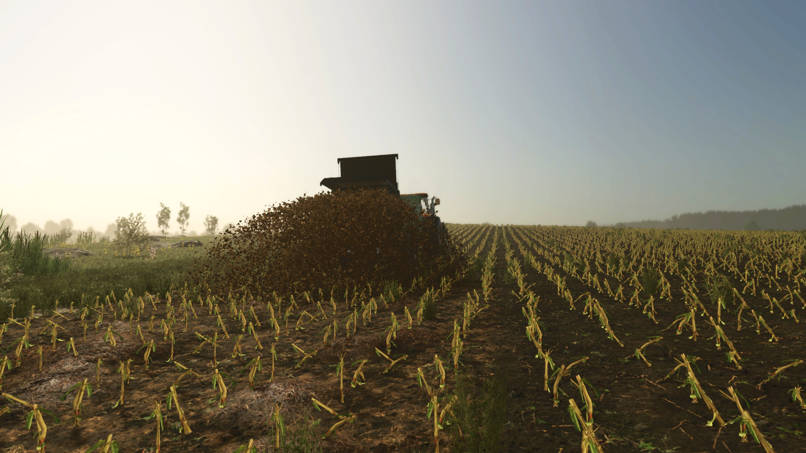
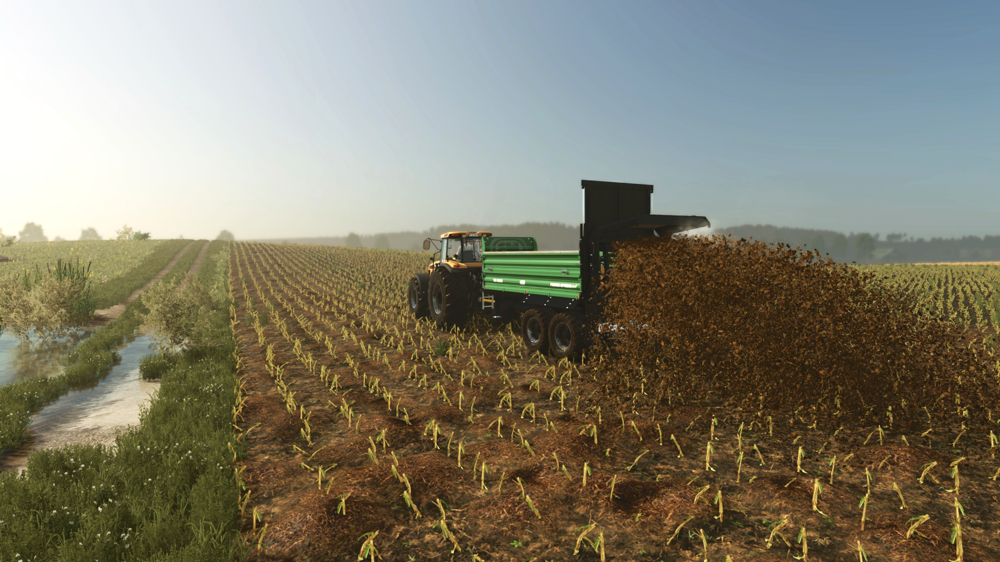
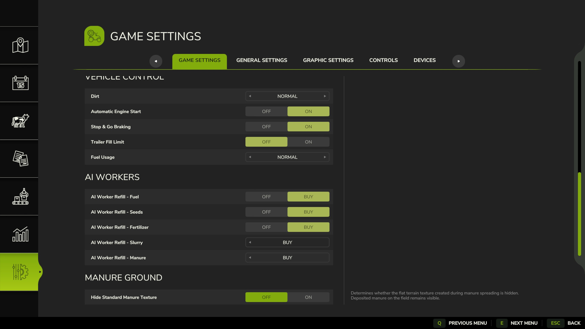

   
  <b>Manure Ground</b> adds deposited manure to fields when using manure spreaders &mdash;
   
  instead of flat ground textures, manure actually lies on the soil.
   
   

## Features

- Manure is deposited directly on the field during spreading.
- Higher application rates of manure result in more manure on the ground.
- Deposited manure cannot be collected back from the field.
- Option in Game Settings to hide the standard flat manure texture.

## Installation

1. Download the latest version of the mod from the [Releases](https://github.com/modnext/manureGround/releases/) page or the official [ModHub](https://www.farming-simulator.com/mod.php?mod_id=369912&title=fs2025).
2. Copy the downloaded `.zip` file to your Farming Simulator mods folder:
   - Windows: `Documents\My Games\FarmingSimulator2025\mods\`
   - macOS: `~/Library/Application Support/FarmingSimulator2025/mods/`
   - Linux: `~/FarmingSimulator2025/mods/`
3. Start Farming Simulator 2025 and enable the mod in the Mods menu.

## Screenshots

## License

Distributed under the GPL-3.0 license. See [LICENSE](https://github.com/modnext/manureGround/blob/main/LICENSE) for more information.
